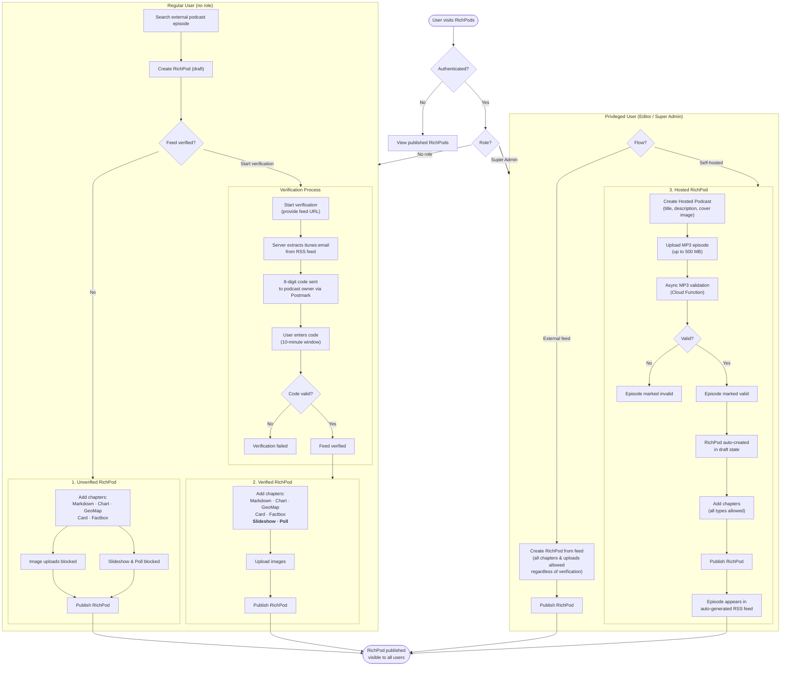
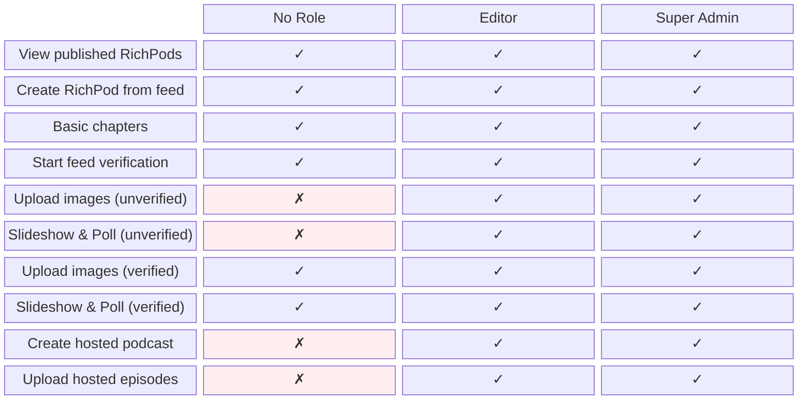

# RichPods User Flows

## Main User Flow

The following diagram shows the end-to-end journey a user takes through RichPods — from initial visit through authentication, role-based routing, and content creation. Regular users can create RichPods from external podcast feeds, with additional capabilities unlocked after verifying feed ownership. Privileged users (Editors and Super Admins) bypass verification restrictions and can additionally create self-hosted podcasts with uploaded episodes.



## Role Assignment

Roles are managed through **Firebase Authentication custom claims** — they are not stored in Firestore. There are two possible role values: `editor` and `super_admin`. Users without an explicitly assigned role are treated as regular users. Both `editor` and `super_admin` are considered privileged roles and currently grant identical permissions.

Roles are assigned manually via a CLI script on the server:

```bash
pnpm --filter @richpods/server exec tsx scripts/set-user-role.ts <firebaseUid> <super_admin|editor|none>
```

The underlying service (`server/src/services/role-claims.service.ts`) calls `adminAuth.setCustomUserClaims()` to write the `role` claim. On each API request, the server reads the role from the decoded ID token (`server/src/services/auth.service.ts`). Role changes take effect when the client presents a fresh ID token (e.g. after token refresh or re-login).

## Capabilities by Role

The matrix below summarizes which actions are available to each role. Key distinctions: regular users without a verified feed cannot upload images or use Slideshow/Poll chapters, while Editors and Super Admins have full access to all chapter types and can create hosted podcasts.


